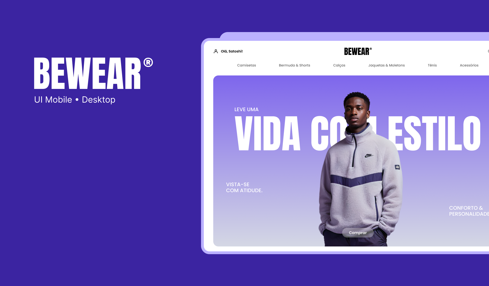

# 🛍️ BEWEAR - E-commerce



Projeto de e-commerce **BEWEAR**, desenvolvido com foco em **performance, escalabilidade e boas práticas**.  
Este repositório contém a aplicação **frontend e backend**, bem como a modelagem do banco de dados.

---

## 📌 Funcionalidades Principais (Requisitos Funcionais)

- 🔍 **SEO (Search Engine Optimization)** para melhor ranqueamento em buscadores.  
- 🔑 Login de usuário (autenticação segura).  
- 🛒 Modificação do carrinho de compras (adicionar/remover itens, alterar quantidades).  
- 📦 Finalização de pedido (um ou mais produtos, com variantes).  
- 💳 Pagamento de pedidos via **cartão de crédito**.  
- 🏠 Gerenciamento de múltiplos endereços de entrega.  
- 📜 Histórico e visualização de pedidos realizados.  

---

## ⚙️ Requisitos Técnicos

- **Frontend:** [React](https://react.dev) + [Next.js](https://nextjs.org)  
- **Backend:** [Node.js](https://nodejs.org)  
- **Banco de Dados:** [PostgreSQL](https://www.postgresql.org) (transações ACID, integridade de dados)  
- **Controle de versão:** Git + GitHub  
- **Gerenciamento de pacotes:** [Yarn](https://yarnpkg.com)  

---

## 🗄️ Banco de Dados

Modelagem principal do sistema (**PostgreSQL**):

- **Usuário** possui **1 carrinho**  
- **Carrinho** possui **N produtos**  
- **Pedido** possui **N produtos**  
- **Categoria** possui **N produtos**  
- **Produto** pode possuir **N variantes**  

---

## 📖 Casos de Uso

- **UC-001:** Login do usuário  
- **UC-002:** Gerenciar carrinho  
- **UC-003:** Finalizar pedido  
- **UC-004:** Pagamento do pedido  
- **UC-005:** Gerenciar endereços  
- **UC-006:** Visualizar pedidos  
- **UC-007:** SEO e descoberta de produtos  

---

## 🗂️ Estrutura do Projeto (sugerida)

```
bewear/
├── frontend/        # React + Next.js
├── backend/         # Node.js API
├── docs/            # Documentos e diagramas (ERD, casos de uso, requisitos)
└── database/        # Scripts SQL e migrações
```

---

## 🚀 Como Rodar o Projeto

1. Clone este repositório:
   ```bash
   git clone https://github.com/seuusuario/bewear.git
   cd bewear
   ```

2. Instale dependências (frontend e backend):
   ```bash
   cd frontend && yarn install
   cd ../backend && yarn install
   ```

3. Configure o banco de dados PostgreSQL e execute as migrações.

4. Inicie o ambiente de desenvolvimento:
   ```bash
   cd frontend && yarn dev
   cd backend && yarn dev
   ```

---

## 📝 Documentação

👉 Veja o documento completo de levantamento de requisitos e modelagem:  
[📄 Levantamento de Requisitos BEWEAR](./docs/levantamento_requisitos_bewear.docx)

---

## 👩‍💻 Autora

**Viviane Aguiar**  
[LinkedIn](https://linkedin.com/in/vivianeaguiarc) • [Portfólio](https://vivianeaguiardev.com.br)
